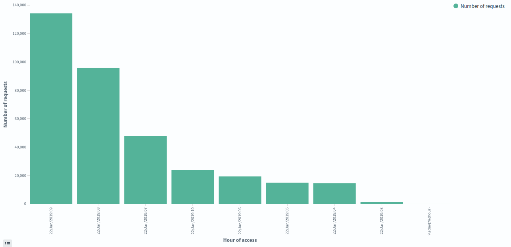
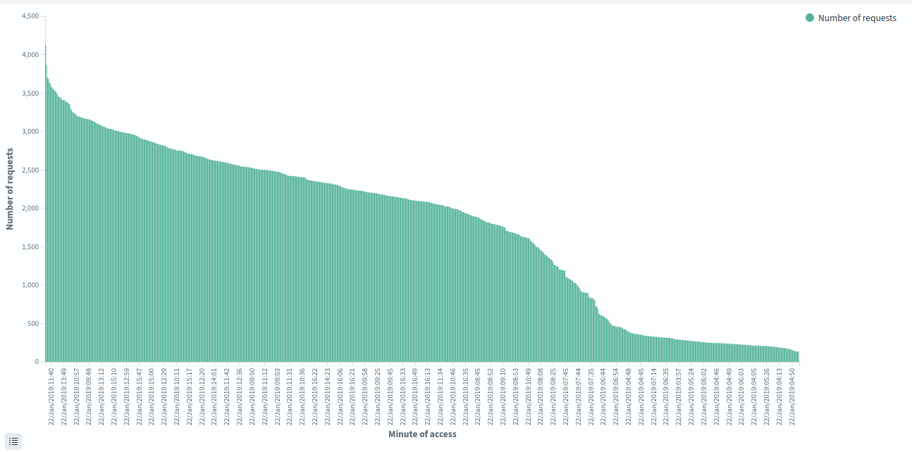
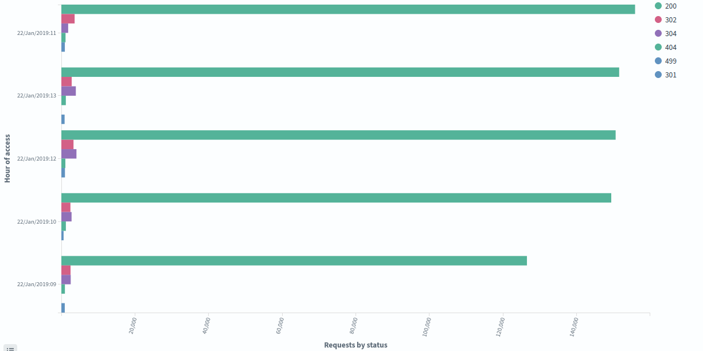

# os_project
Система для парсинга и представления данных из веб логов
## Описание

Этот проект реализует систему для автоматического парсинга и визуализации логов с использованием **Logstash**, **OpenSearch** и **OpenSearch Dashboards**. Система собирает данные из логов, структурирует их с помощью Grok, обрабатывает поля и визуализирует в виде дашбордов.

## Используемые технологии

- **Docker** — контейнеризация компонентов
- **Logstash 7.17.13** — обработка и парсинг логов
- **OpenSearch 3.1.0** — хранение и индексирование данных
- **OpenSearch Dashboards 3.1.0** — визуализация логов

## Запуск проекта

Для работы необходим установленный Docker и Docker Compose.

1. Клонируйте репозиторий:
   ```bash
   git clone https://github.com/oxordth/os_project.git
   cd os_project
   ```
2. Запустите сервисы с помощью Docker:
   ```bash
   docker compose up -d
   ```
3. Доступ после запуска контейнеров:
   - OpenSearch доступен на: http://localhost:9200
   - Dashboards доступны на: http://localhost:5601

## Работа программы

1. Logstash обрабатывает лог-файл access.log, расположенный в logstash/logs/
2. Используется фильтр Grok, а также фильтры date, mutate, useragent для создания полей
3. Настроено автоматическое создание индексов в OpenSearch на основе времени создания лога (web-logs-%{+YYYY.MM.dd})
4. Logstash использует 8 ГБ оперативной памяти, OpenSearch — 4 ГБ

## Пример визуализации

1. Визуализация количества запросов почасово


2. Визуализация количества запросов поминутно


3. Визуализация статусов запросов почасово


## Пример json вывода логов

```json
{
          "day": "22/Jan/2019",
          "respond_size": "11916",
          "useragent": {
            "os": "Android",
            "major": "71",
            "device": "Generic Smartphone",
            "os_version": "7.0",
            "os_minor": "0",
            "name": "Chrome Mobile",
            "os_name": "Android",
            "os_full": "Android 7.0",
            "patch": "3578",
            "minor": "0",
            "os_major": "7",
            "version": "71.0.3578.83"
          },
          "@timestamp": "2019-01-22T01:58:02.000Z",
          "refer": "https://www.zanbil.ir/m",
          "status": 200,
          "@version": "1",
          "uri": "/image/11893/productType/240x180",
          "client_ip": "146.185.149.152",
          "method": "GET",
          "path": "/usr/share/logstash/logs/access.log",
          "hour": "05",
          "http": "1.1",
          "hour_of_access": "22/Jan/2019:05",
          "host": "3976be95d6ec",
          "minute_of_access": "22/Jan/2019:05:28",
          "message": "146.185.149.152 - - [22/Jan/2019:05:28:02 +0330] \"GET /image/11893/productType/240x180 HTTP/1.1\" 200 11916 \"https://www.zanbil.ir/m\" \"Mozilla/5.0 (Linux; Android 7.0 SHA; ZUK Z2121) AppleWebKit/537.36 (KHTML, like Gecko) Chrome/71.0.3578.83 Mobile Safari/537.36\" \"-\"",
          "minute": "28"
        }
```
```json
{
          "day": "22/Jan/2019",
          "respond_size": "40970",
          "useragent": {
            "os": "Other",
            "major": "2",
            "device": "Spider",
            "minor": "1",
            "os_name": "Other",
            "name": "Googlebot",
            "os_full": "Other",
            "version": "2.1"
          },
          "@timestamp": "2019-01-22T01:56:52.000Z",
          "refer": "-",
          "status": 200,
          "@version": "1",
          "uri": "/filter/b703%2Cb32%2Cb67%2Cb226%2Cb41%2Cb598%2Cb168%2Cb723%2Cb597%2Cb88%2Cb548%2Cb6%2Cb679%2Cb215%2Cb105%2Cb194%2Cb74%2Cb542%2Cb35%2Cb113%2Cb820%2Cb574%2Cb442%2Cb880%2Cb645%2Cb724%2Cb118%2Cb482%2Cb400%2Cb95%2Cb135%2Cb249%2Cb435%2Cb221%2Cb523%2Cb854%2Cb126%2Cstexists%2Cb216%2Cb217%2Cb152%2Cb99%2Cb188%2Cb209%2Cb192%2Cb213%2Cb136%2Cb218%2Cb4%2Cb648%2Cb701%2Cb20%2Cb573%2Cb647%2Cb874%2Cb584%2Cb185%2Cb186%2Cb8%2Cb2%2Cb258%2Cb43?page=2",
          "client_ip": "66.249.66.91",
          "method": "GET",
          "path": "/usr/share/logstash/logs/access.log",
          "hour": "05",
          "http": "1.1",
          "hour_of_access": "22/Jan/2019:05",
          "host": "3976be95d6ec",
          "minute_of_access": "22/Jan/2019:05:26",
          "message": "66.249.66.91 - - [22/Jan/2019:05:26:52 +0330] \"GET /filter/b703%2Cb32%2Cb67%2Cb226%2Cb41%2Cb598%2Cb168%2Cb723%2Cb597%2Cb88%2Cb548%2Cb6%2Cb679%2Cb215%2Cb105%2Cb194%2Cb74%2Cb542%2Cb35%2Cb113%2Cb820%2Cb574%2Cb442%2Cb880%2Cb645%2Cb724%2Cb118%2Cb482%2Cb400%2Cb95%2Cb135%2Cb249%2Cb435%2Cb221%2Cb523%2Cb854%2Cb126%2Cstexists%2Cb216%2Cb217%2Cb152%2Cb99%2Cb188%2Cb209%2Cb192%2Cb213%2Cb136%2Cb218%2Cb4%2Cb648%2Cb701%2Cb20%2Cb573%2Cb647%2Cb874%2Cb584%2Cb185%2Cb186%2Cb8%2Cb2%2Cb258%2Cb43?page=2 HTTP/1.1\" 200 40970 \"-\" \"Mozilla/5.0 (compatible; Googlebot/2.1; +http://www.google.com/bot.html)\" \"-\"",
          "minute": "26"
        }
```
